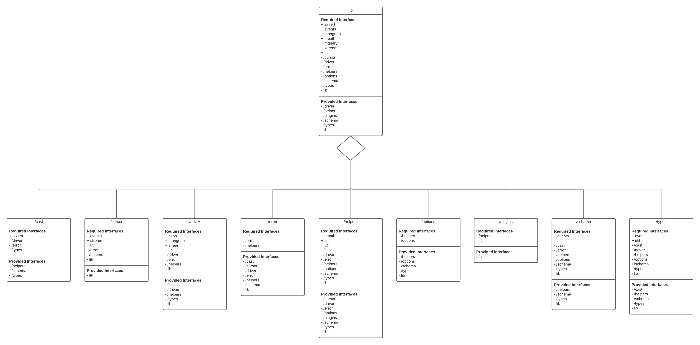

# Project 2: Mongoose

## By Jason Xu, Crosby Huang, David Xie, Jerome Orille

# Introduction

Mongoose provides an Object Relational Model (ORM) for Node.js applications to connect to MongoDB NoSQL databases. This framework is primarily written in JavaScript with a little bit of TypeScript code.

Mongoose is used as an interface to MongoDB by defining models to interact with the database. Some interactions that users can do include querying and any other SQL commands. This makes it necessary for users to use to access a MongoDB database. Additionally, it also enforces strongly-typed schemas as well. Overall the library aims to make working with MongoDB easier for developers with the features mentioned above. 

People who maintain mongoose are a team or company called Automattic. This company also maintains a bunch of other websites or applications like Tumblr, Jetpack, and Gravatar. The Automattic company is in charge of approving changes to the code.

# Development View

*Figure 1: Components of Mongoose*

We created a component diagram that details relationships between other components. Our components scope is limited to **directories/folders**. Our reasoning is that there are too many code files to individually analyze, so breaking it up into directories as components felt like the natural thing to do. In our diagram, each component has a **required interface** section and a **provided interface** section.

Required interfaces include modules that are needed for the module to work. Modules marked with a + are outside modules like `assert` or `mongodb`, while modules marked with a - are Mongoose modules.  For example, the `cast` directory requires`assert`, which is an outside dependency, and at least one file in the `driver` directory.

Provided interfaces include modules that need the module to work. Going back to the `cast` directory, the `helpers` directory needs at least one file provided from the `cast` directory for its modules to work. This is why the `helpers` directory is listed as a provided interface for the `cast` component.

Initially the components were linked together by relationship, but this ended up being very messy for a model. The components are in the /lib directory, which is the directory at the very top. The /lib directory contains all folders underneath. The folders are listed below:

|**Directory**|**Description**|
|---|---|
|`/cast`|Converts primitives and objects to other types|
|`/cursor`|Used for navigation|
|`/driver`|Sets up connection information|
|`/error`|Error handling functions|
|`/helpers`|Helper functions for use in other modules|
|`/options`|Populates interface with changeable options|
|`/plugins`|Additional options users may install|
|`/schema`|Defines a MongoDB schema, which is like a table in SQL|
|`/types`|Defines objects that may be used in Mongoose|