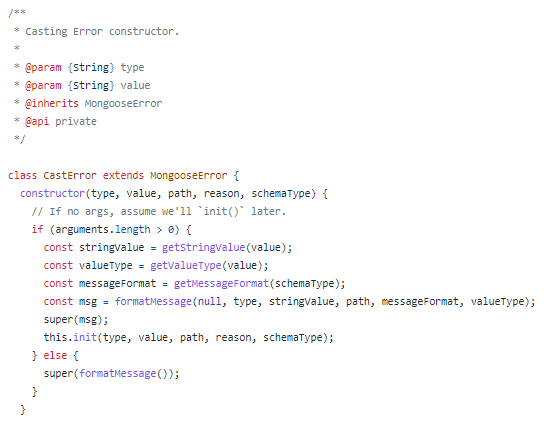

# Project 2: Mongoose

## By Jason Xu, Crosby Huang, David Xie, Jerome Orille

# Introduction

Mongoose provides an Object Relational Model (ORM) for Node.js applications to connect to MongoDB NoSQL databases. This framework is primarily written in JavaScript with a little bit of TypeScript code.

Mongoose is an abstracted  interface of MongoDB by defining models to interact with the database using native JavaScript syntax and semantics. Users can define a schema and perform query operations on MongoDB using Mongoose. Additionally, it provides an option for users to enforce strongly-typed schemas as well. Overall the library aims to make working with MongoDB easier for JavaScript application developers with the features mentioned above.

People who maintain mongoose are a team or company called Automattic. This company also maintains a bunch of other websites or applications like Tumblr, Jetpack, and Gravatar. The Automattic company is in charge of approving changes to the code.

- The Mongoose code’s GitHub repository is [https://github.com/Automattic/mongoose](https://github.com/Automattic/mongoose)
- The Mongoose API and usage documentation is [https://mongoosejs.com/docs/guides.html](https://mongoosejs.com/docs/guides.html)
- The MongoDB query documentation is [https://docs.mongodb.com/manual/introduction/](https://docs.mongodb.com/manual/introduction/) (however, it is not necessary to write MongoDB queries in JavaScript programs that uses Mongoose)

# Development View

## Component Diagram

*Figure 1: Components of Mongoose*

We created a component diagram that details relationships between other components. Our components scope is limited to **directories/folders**. Our reasoning is that there are too many code files to individually analyze, so breaking it up into directories as components felt like the natural thing to do. In our diagram, each component has a **required interface** section and a **provided interface** section.

Required interfaces include modules that are needed for the module to work. Modules marked with a + are outside modules like `assert` or `mongodb`, while modules marked with a - are Mongoose modules.  For example, the `cast` directory requires`assert`, which is an outside dependency, and at least one file in the `driver` directory.

Provided interfaces include modules that need the module to work. Going back to the `cast` directory, the `helpers` directory needs at least one file provided from the `cast` directory for its modules to work. This is why the `helpers` directory is listed as a provided interface for the `cast` component.

Initially the components were linked together by relationship, but this ended up being very messy for a model. The components are in the /lib directory, which is the directory at the very top. The /lib directory contains all folders underneath. The folders are listed below:

|**Directory**|**Description**|
|---|---|
|`/lib`|Contains Mongoose source code and JavaScript files that start the program|
|`/cast`|Converts primitives and objects to other types|
|`/cursor`|Used for table navigation|
|`/driver`|Sets up connection information|
|`/error`|Error handling functions|
|`/helpers`|Helper functions for use in other modules|
|`/options`|Populates interface with changeable options|
|`/plugins`|Additional options users may install|
|`/schema`|Defines a MongoDB schema, which is like a table in SQL|
|`/types`|Defines objects that may be used in Mongoose|

## Source Code Structures

*Figure 2: Mongoose Source Code*

Our codeline model shows **all the source code** in the Mongoose repository.  Again, we used **directories** for the codeline model because directories are more in line with the scope of Mongoose’s architecture rather than individual files. Many folders, like `/lib`, have many directories underneath them as well. This diagram is shown above. There is a table below that also describes the codeline model more thoroughly.

| Root folder | Directory Level 1 | Directory Level 2     | Feature                                                                                                                                                                                                                     |
|-------------|-------------------|-----------------------|-----------------------------------------------------------------------------------------------------------------------------------------------------------------------------------------------------------------------------|
| /           |                   |                       | Contains everything of the Mongoose module, including library codes, test suites, documentations, example programs, and more.                                                                                               |
|             | .github/          |                       | Github repository-specific content, showing project funding channels, issue template, and pull request templates                                                                                                            |
|             |                   | workflow/             | Contain Github workflow files, such as automate running Mocha tests in the test/ directory                                                                                                                                  |
|             | benchmarks/       |                       | Performance benchmark JavaScript programs for testing Mongoose framework’s performance (in-practice runtime).                                                                                                               |
|             | docs/             |                       | All website files (HTML, CSS, JavaScript) for Mongoose documentation site: https://mongoosejs.com/ , applicable to Mongoose 6.2.x, 5.13.x, 4.13.x versions.                                                                 |
|             |                   | 2.7.x/ to 3.5.x/      | Contains website files for documentations of old versions of Mongoose.                                                                                                                                                      |
|             |                   | all other directories | Folders that group a number of similar website dependency files together (such as pictures on this site in images/ folder and website JavaScript files located in js/ files)                                                |
|             | examples/         |                       | This directory contains sample Mongoose programs that can be run on Node.js environments. External JavaScript developers can quickly get started on using Mongoose by referencing .js codes in this directory.              |
|             |                   | all directories       | Folders that group a number of .js files showcasing different Mongoose capabilities/functions together, allowing external JS developers quickly locate sample programs by features (what goal do these programs accomplish) |
|             | lib/              |                       | The root folder of Mongoose source code.                                                                                                                                                                                    |
|             |                   | all directories       | Refer to the above table for what the source code inner folders are about.                                                                                                                                                  |
|             | test/             |                       | Unit testing files that test the Mongoose functionality and correctness. Test files are written in JavaScript using the Mocha testing framework.                                                                            |
|             |                   | all directories       | Groups a number of common test.js files based on Mongoose functionalities and components that test programs are trying to test on.                                                                                          |
|             | tools/            |                       | Contains asynchronous tools for authorization, unit testing, etc.                                                                                                                                                           |
|             | types/            |                       | Enable developers using Mongoose in TypeScript programs by providing type declarations.                                                                                                                                     |

## Testing and Configuration

Mongoose library uses Mocha testing framework to test its codes. The testing files are located underneath the `test` folder, which is located in the root folder. There are many test files that Mongoose uses.

*Figure 3: Example of Testing Code*

Many test files require the use of a common test file called `common.js`. This is located underneath the `/test` folder. Some outside dependencies include the `assert` library, the `collection` component located in the `/lib` folder, and some error validation (not pictured) which is located in the `error` component in `/lib`. Since `assert` is used, this means that Mongoose utilizes **unit testing** on individual components for their testing. 

*Figure 4: `common.js` Test File*

This `common.js` test file contains many functions that other testing files use. Figure 4 above shows the first few lines of `common.js`. Because this test file is well-defined and has common functions for use in other test files, this would be a great starting point to figure out how to test code for Mongoose. 

*Figure 5: Mongoose Branches*

Additionally, many developers use their own branches to test code. As of the time of fetching the repository, there are **over 100 different test branches**. Using branches allows developers to create pull requests for bug fixes and other improvements to the code. The Mongoose team would evaluate these pull requests and approve or deny changes if necessary.

# Applied Perspective

*Figure 6: Example of defined schema using Mongoose*

It’s important to understand that MongoDB is a document-based database. In contrast to relational databases, this means that their data stored can be ‘unstructured’. While this offers benefits such as a more streamlined process of updating entries in the database, the lack of a rigid schema can make it difficult to enforce restrictions or specific data types allowed to be entered in the database.

Therefore, the main perspective that the Mongoose library falls under is the **Usability Perspective** by which it allows its users (Node.js developers) to more easily interact with the target system (MongoDB database) in order to work more effectively.  As it is an Object Document Mapper (ODM), it provides the functionality for its users to actually enforce that schema design. This then serves as an interface to the MongoDB database where those users can perform CRUD operations on entries in the collection while still abiding by said schema restrictions.

**Information Quality**.
The concern is that if information within a database cannot be relied upon due to a lack of consistency, then the database cannot be utilized in a way that the developers intended for.

Thus, the schema type enforcement reduces the client code’s need to add more code (insert design pattern here) to check returned data (from database) and cast to client’s desired type.

*Figure 7: Example of sanitizeFilter function*

One example of this is that Mongoose’s library provides a `sanitizeFilter()` function that wraps any nested objects containing a property whose name starts with `$`(which are query operators) in a `$eq` instead. This prevents malicious users from executing query selector injection attacks and further ensures that the data passed in can be more trusted.

**Usability with the Interface**.

When developers are constantly working with their MongoDB database to fetch and insert data, Mongoose plays a pivotal role in making the process easier for them to interact with the interface. For instance, Mongoose allows users to easily define relationships between two schemas via the `type` and `ref` properties which point to the `ObjectId` of the specific schema it is related to.

*Figure 8: Custom Validation in Data Schemas within Mongoose*

Mongoose also improves usability by allowing for custom, flexible data validation. The example above showcases how users can define a `validator` function where one can set the schema to only hold strings that meet the conditions of the defined regular expression when trying to insert data.

Overall, the goal of this perspective in the Mongoose system is to allow developers to avoid the common pitfall of using inconsistent approaches to data entry validation when reading and writing to their databases.

# Identify Styles and Patterns

## High-level architectural style
We believe that the mongoose applies the Layered architectural style. The users’ script works as the presentational layer and the mongoose works as the business layer, and the mongoDB is the data layer.

## Facade Pattern
The Mongoose itself follows an Facade pattern, as it translates between objects in JavaScript code and the representation of those objects in MongoDB. JavaScript developers can perform MongoDB operations by invoking Mongoose in typical JavaScript-like syntax rather than referencing MongoDB Shell syntax.

## Mediator Pattern
According to [documentation](https://mongoosejs.com/docs/tutorials/query_casting.html), when Mongoose fails to cast the passed in data type to the enforced data type in the schema, it throws an instance of the `CastError` class. Rather than handling the error processing themselves, the `castString` and `castBoolean` functions pass in the type, value, and path to the CastError class which serves as the mediator between the components. The CastError class then takes in the passed arguments and eventually returns the respective error message to be displayed back to the client. Therefore, this communication between different components (lib/cast/string.js and lib/cast/boolean.js) and the central authority, `CastError` class showcases the Mediator Pattern.

*Instance of CastError in "lib/cast/string.js"*

*CastError class in "lib/error/cast.js"*

# Architectural Assessment

## Open Close Principle

Instead of hard coding data types of Mongoose schemas, Mongoose developers opted for processing each (supported) data types in separate files/modules. They are being referenced in SchemaType(path, options, instance) located in ./lib/schematype.js . This allows MongoDB developers to create more files/modules to support new data type of MongoDB in future.

## Single Responsibility Principle

JavaScript files within `./lib/schema` handles data type (of the corresponding MongoDB schema types) individually (each JavaScript file handles own MongoDB data type). For instance, code handling String data type don’t need to know the code handling Date data type. Clients of Mongoose will define MongoDB schemas in a fashion similar to this:
`const postSchema = new mongoose.Schema({
url: String,
description: String,
username: String,
likes: [String],
created_date: Date
})`

## Dependency Inversion Principle

Within `./lib/error` directory, there are several error handling files that extends `MongooseError` class , and `MongooseError` class also extends the built-in JavaScript `Error` class.

In the `DivergentArrayError` that extends `MongooseError`, it has a `super(msg)` function that calls the `MongooseError` super class. This coding style follows dependency inversion principle, because developers can add new (more specific) `MongooseError` class files that extends `MongooseError`.

## Interface Segregation Principle
TODO

##Law of Demeter

Web applications using Mongoose will communicate with Mongoose itself, rather directly to MongoDB. Mongoose forward clients’ requests to MongoDB.

Also, the example used in Open Close Principle and Single Responsibility Principle follows the Law of Demeter, as the function using a Data Type processor (with respect to MongoDB Data Type) don’t need to know the actual implementation of processors themselves.

## Liskov Substitution Principle

For the **Liskov Substitution Principle**, there are two classes that promote this design pattern. These files are located in `lib/document.js`, which is the Document class, and `lib/types/subdocument.js`, which is the SubDocument class. See Figures ? and ?? below.

*Figure ?: `lib/document.js`*

*Figure ??: `lib/types/subdocument.js`*

These two classes promote the *Liskov Substitution Principle* because the `SubDocument` could completely replace an instance of the `Document` class. This is because the `SubDocument` checks if there is a valid parent of itself. If there isn’t, then it just calls the `Document` class. This means that the `SubDocument` instance would just be a `Document` object. There is some extra logic when it does have a parent, but it still calls the `Document` class in the end.

## Composite Reuse Principle

Within `./lib/cast` folder, `boolean.js` uses an instance of `CastError` when it can’t convert a given to a boolean value. Since `boolean.js` does not inherit the `CastError` itself and the `CastError` can exist by itself without `boolean.js` codes, `boolean.js` follows the Composite Reuse Principle.
